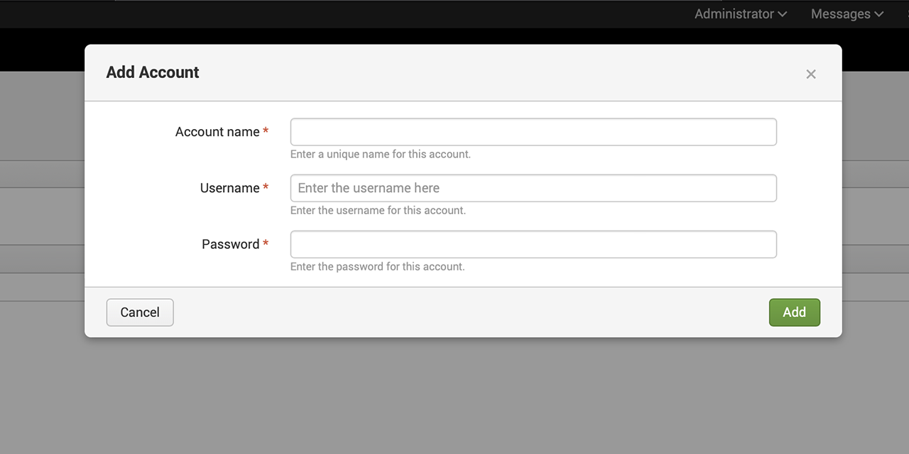
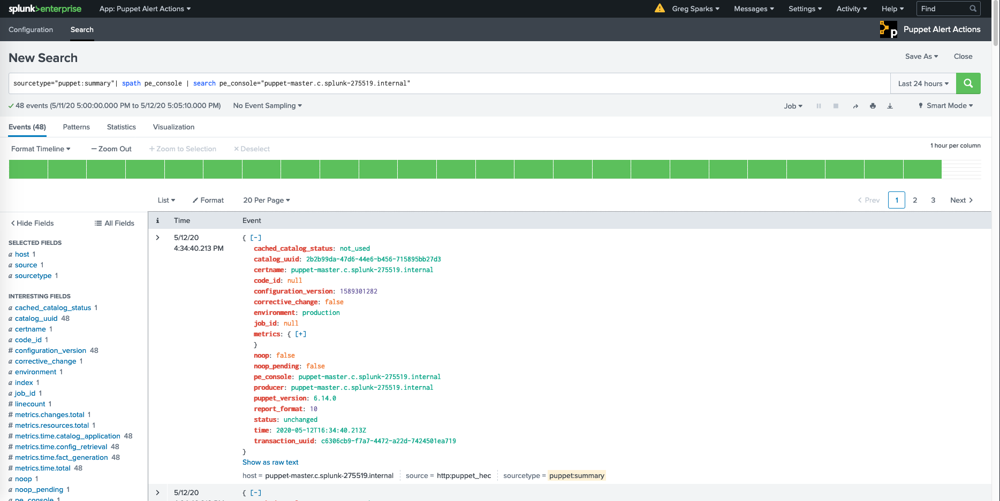
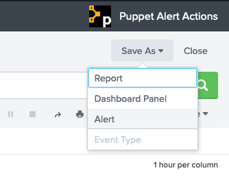

# Puppet Alert Actions

##### Table of Contents

1. [Description](#description)
2. [Configuration](#configuration)
3. [Usage](#usage)
4. [Troubleshooting and Verification](#troubleshooting-and-verification)
5. [Breaking Changes](#breaking-changes)

## Description

This Splunk add-on can be used to trigger actions in Puppet Enterprise such as task execution or report generation based on data received from Puppet Enterprise.

This add-on is intended to be used alongside the [Puppet Report Viewer](https://splunkbase.splunk.com/app/4413/), with data provided by the [splunk_hec](https://forge.puppet.com/puppetlabs/splunk_hec) report processor available on the Puppet Forge.

## Configuration

After installing and configuring both the `splunk_hec` Puppet module and the Puppet Report Viewer app for Splunk; follow the steps below to configure the [Puppet Alert Actions](https://splunkbase.splunk.com/app/4928/) add-on:

* **Account**:
  * Descriptive Account Name
  * PE RBAC User
  * Password

	

* **Configuration**:
  * PE Console URL
  * Account Name
  * Splunk HEC URL
  * HEC Token
	
	

## Usage

Once the add-on has been properly configured you can begin creating new Alerts to trigger specified actions (e.g. Run a Task, Generate a Detailed Report) when a new event matching the Alert is received by Splunk.

1. Create a Splunk search:

	
	
2. Save the search as an Alert:

	

3. Configure the Alert Actions:

	

## Troubleshooting and Verification

To check the logs of the individual Alerts you can search the internal log index in Splunk with the following search:

  * `index=_internal sourcetype=splunkd component=sendmodalert`
	
	**Note**: Error message verbosity depends on the log level of your installation.

Individual Alert Actions are logged to the the Splunk folder (`/opt/splunk/var/log/splunk`) on the system running the actions.

## Breaking Changes

**Note**: This release of the Puppet Alert Actions add-on no longer utilizes Splunk's Python2 SDK. As such this version will only work on Splunk Enterprise 8.x and Splunk Cloud.
